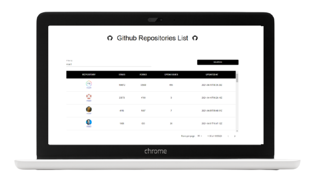

# **TDD Search Form**

This form has been developed applying Test Driven Development with
[](https://es.reactjs.org/),
[](https://jestjs.io/),
[](https://testing-library.com/),
[](https://mswjs.io/)
and
[](https://material-ui.com/)

This exercise is part of the
[**Test Driven Development (TDD) en React JS**](https://www.udemy.com/course/tdd-react-js/?referralCode=F40803D2C4D2934AB038)
course.

**NOTE:** a [**mock server**](https://mswjs.io/) and the
[**Github REST API**](https://docs.github.com/en/rest/overview/resources-in-the-rest-api)
have been used to develop this exercise.

## **Quick start guide**

Instructions to start this project:

### Installation

- Clone repository:

```
git clone [repository]
```

- Install NPM packages and dependencies:

```
npm install
```

- Run project on local server

```
npm start
```

- [**Project URL**](https://anaguerraabaroa.github.io/react-tdd-search-form/) is
  also available on GitHub Pages.

### Tests

- Run tests:

```
npm run test
```

## **Project features**

**Github Repositories List**

As a developer, I want to take a quick look at the github repositories as a way
of inspiring me to be better professional.

**Acceptance Criteria**

- There must be a github repositories list page.

- The page should contain the next filters:

  - An input text with label "filter by" field in order to do the search.
  - The Search Button.

  ```javascript
  describe('when the GithubSearchPage is mounted', () => {
    it('must display the title', () => {
      expect(
        screen.getByRole('heading', {name: /github repositories list/i}),
      ).toBeInTheDocument()
    })

    it('must be an input text with label "filter by" field', () => {
      expect(screen.getByLabelText(/filter by/i)).toBeInTheDocument()
    })

    it('must be a search button', () => {
      expect(screen.getByRole('button', {name: /search/i})).toBeInTheDocument()
    })

    it('must be an initial message "Please provide a search option and click in the search button"', () => {
      expect(
        screen.getByText(
          /please provide a search option and click in the search button/i,
        ),
      ).toBeInTheDocument()
    })
  })
  ```

- The results section should contain:
  - Before the first search, show the initial state message “Please provide a
    search option and click in the search button”.
  - The search button should be disabled until the search is done.
  - The data should be displayed as a sticky table.
  - The header table should contain: Repository, stars, forks, open issues and
    updated at
  - Each result should have: owner avatar image, name, stars, updated at, forks,
    open issues. It should have a link that opens in a new tab the github
    repository selected.
  - Total results number of the search and the current number of results.
    Example: 1-10 of 100.
  - A results size per page select/combobox with the options: 30, 50, 100. The
    default is 30.
  - Next and previous pagination when the context applies to them, example: on
    the first page, the previous page should be disabled.

```javascript
describe('when the developer does a search', () => {
  it('the search button should be disabled until the search is done', async () => {
    expect(screen.getByRole('button', {name: /search/i})).not.toBeDisabled()

    fireEvent.change(screen.getByLabelText(/filter by/i), {
      target: {value: 'test'},
    })

    expect(screen.getByRole('button', {name: /search/i})).not.toBeDisabled()

    fireClickSearch()

    expect(screen.getByRole('button', {name: /search/i})).toBeDisabled()

    await waitFor(() =>
      expect(screen.getByRole('button', {name: /search/i})).not.toBeDisabled(),
    )
  })

  it('the data should be displayed as a sticky table', async () => {
    fireClickSearch()

    await waitFor(() =>
      expect(
        screen.queryByText(
          /please provide a search option and click in the search button/i,
        ),
      ).not.toBeInTheDocument(),
    )

    expect(screen.getByRole('table')).toBeInTheDocument()
  })

  it('the table header must contain: repository, stars, forks, open issues and updated at', async () => {
    fireClickSearch()

    const table = await screen.findByRole('table')

    const tableHeaders = within(table).getAllByRole('columnheader')

    expect(tableHeaders).toHaveLength(5)

    const [repository, stars, forks, openIssues, updatedAt] = tableHeaders
    expect(repository).toHaveTextContent(/repository/i)
    expect(stars).toHaveTextContent(/stars/i)
    expect(forks).toHaveTextContent(/forks/i)
    expect(openIssues).toHaveTextContent(/open issues/i)
    expect(updatedAt).toHaveTextContent(/updated at/i)
  })

  it('each table result must contain: owner avatar image, name, stars, updated at, forks, open issues, updated at, it should have a link that opens in a new tab', async () => {
    fireClickSearch()

    const table = await screen.findByRole('table')

    const withinTable = within(table)

    const tableCells = withinTable.getAllByRole('cell')

    const [repository, stars, forks, openIssues, updatedAt] = tableCells

    const avatarImg = within(repository).getByRole('img', {name: fakeRepo.name})
    expect(avatarImg).toBeInTheDocument()

    expect(tableCells).toHaveLength(5)

    expect(repository).toHaveTextContent(fakeRepo.name)
    expect(stars).toHaveTextContent(fakeRepo.stargazers_count)
    expect(forks).toHaveTextContent(fakeRepo.forks_count)
    expect(openIssues).toHaveTextContent(fakeRepo.open_issues_count)
    expect(updatedAt).toHaveTextContent(fakeRepo.updated_at)

    expect(withinTable.getByText(fakeRepo.name).closest('a')).toHaveAttribute(
      'href',
      fakeRepo.html_url,
    )

    expect(avatarImg).toHaveAttribute('src', fakeRepo.owner_avatar_url)
  })

  it('must display the total results number of the search and the current number of results', async () => {
    fireClickSearch()

    await screen.findByRole('table')

    expect(screen.getByText(/1-1 of 1/i)).toBeInTheDocument()
  })

  it('results size per page select/combobox with the options: 30, 50, 100. The default is 30', async () => {
    fireClickSearch()

    await screen.findByRole('table')

    expect(screen.getByLabelText(/rows per page/i)).toBeInTheDocument()

    fireEvent.mouseDown(screen.getByLabelText(/rows per page/i))

    const listbox = screen.getByRole('listbox', {name: /rows per page/i})

    const options = within(listbox).getAllByRole('option')

    const [option30, option50, option100] = options

    expect(option30).toHaveTextContent(/30/)
    expect(option50).toHaveTextContent(/50/)
    expect(option100).toHaveTextContent(/100/)
  })

  it('must exists the next and previous pagination button', async () => {
    fireClickSearch()

    await screen.findByRole('table')

    const previousPageBtn = screen.getByRole('button', {name: /previous page/i})

    expect(previousPageBtn).toBeInTheDocument()

    expect(screen.getByRole('button', {name: /next page/i})).toBeInTheDocument()

    expect(previousPageBtn).toBeDisabled()
  })
})
```

- If there is no results, then show a empty state message “You search has no
  results”

```javascript
describe('when the developer does a search without results', () => {
  it('must display an empty state message: "Your search has no results', async () => {
    server.use(
      rest.get('/search/repositories', (req, res, ctx) =>
        res(ctx.status(OK_STATUS), ctx.json(makeFakeResponse({}))),
      ),
    )

    fireClickSearch()

    await waitFor(() =>
      expect(
        screen.getByText(/your search has no results/i),
      ).toBeInTheDocument(),
    )

    expect(screen.queryByRole('table')).not.toBeInTheDocument()
  })
})
```

- Handling filter:
  - If the developer types "ruby" in the filter by repository name input and
    clicks on search, the app should return repositories with the "ruby" word
    associated.

```javascript
describe('when the developer types on filter by and does a search', () => {
  it('must display the related repos', async () => {
    const internalFakeResponse = makeFakeResponse()
    const REPO_NAME = 'laravel'
    const expectedRepo = getReposListBy({name: REPO_NAME})[0]

    server.use(
      rest.get('/search/repositories', (req, res, ctx) =>
        res(
          ctx.status(OK_STATUS),
          ctx.json({
            ...internalFakeResponse,
            items: getReposListBy({name: req.url.searchParams.get('q')}),
          }),
        ),
      ),
    )

    fireEvent.change(screen.getByLabelText(/filter by/i), {
      target: {value: REPO_NAME},
    })

    fireClickSearch()

    const table = await screen.findByRole('table')

    expect(table).toBeInTheDocument()

    const withinTable = within(table)

    const tableCells = withinTable.getAllByRole('cell')

    const [repository] = tableCells

    expect(repository).toHaveTextContent(expectedRepo.name)
  })
})
```

- Size per page:

  - If the developer clicks on search button and then selects 50 per page value,
    the app should show 50 repositories on the table

```javascript
describe('when the developer does a search and selects 50 rows per page', () => {
  it('must fetch a new search and display 50 rows results on the table', async () => {
    server.use(rest.get('/search/repositories', handlerPaginated))

    fireClickSearch()

    expect(await screen.findByRole('table')).toBeInTheDocument()
    expect(await screen.findAllByRole('row')).toHaveLength(31)

    fireEvent.mouseDown(screen.getByLabelText(/rows per page/i))

    fireEvent.click(screen.getByRole('option', {name: '50'}))

    await waitFor(
      () =>
        expect(
          screen.getByRole('button', {name: /search/i}),
        ).not.toBeDisabled(),
      {timeout: 3000},
    )

    expect(screen.getAllByRole('row')).toHaveLength(51)
  }, 6000)
})
```

- Pagination:

  - If the developer clicks on search and then on next page button, the app
    should show the next repositories.

```javascript
describe('when the developer does a search and clicks on next page button and selects 50 rows per page', () => {
  it('must display the results of the first page', async () => {
    server.use(rest.get('/search/repositories', handlerPaginated))

    fireClickSearch()

    expect(await screen.findByRole('table')).toBeInTheDocument()

    expect(screen.getByRole('cell', {name: /1-0/i})).toBeInTheDocument()

    expect(screen.getByRole('button', {name: /next page/i})).not.toBeDisabled()

    fireEvent.click(screen.getByRole('button', {name: /next page/i}))

    expect(screen.getByRole('button', {name: /search/i})).toBeDisabled()

    await waitFor(
      () =>
        expect(
          screen.getByRole('button', {name: /search/i}),
        ).not.toBeDisabled(),
      {timeout: 3000},
    )

    expect(screen.getByRole('cell', {name: /2-0/i})).toBeInTheDocument()

    fireEvent.mouseDown(screen.getByLabelText(/rows per page/i))

    fireEvent.click(screen.getByRole('option', {name: '50'}))

    await waitFor(
      () =>
        expect(
          screen.getByRole('button', {name: /search/i}),
        ).not.toBeDisabled(),
      {timeout: 3000},
    )

    expect(screen.getByRole('cell', {name: /1-0/i})).toBeInTheDocument()
  }, 30000)
})
```

- If the developer clicks on search and then on next page button and then clicks
  on previous button, the app should show the previous repositories.

  ```javascript
  describe('when the developer clicks on search and then on next page button and then on previous page button', () => {
    it('must display the previous repositories page', async () => {
      server.use(rest.get('/search/repositories', handlerPaginated))

      fireClickSearch()

      expect(await screen.findByRole('table')).toBeInTheDocument()

      expect(screen.getByRole('cell', {name: /1-0/i})).toBeInTheDocument()

      expect(
        screen.getByRole('button', {name: /next page/i}),
      ).not.toBeDisabled()

      fireEvent.click(screen.getByRole('button', {name: /next page/i}))

      expect(screen.getByRole('button', {name: /search/i})).toBeDisabled()

      await waitFor(
        () =>
          expect(
            screen.getByRole('button', {name: /search/i}),
          ).not.toBeDisabled(),
        {timeout: 3000},
      )

      expect(screen.getByRole('cell', {name: /2-0/i})).toBeInTheDocument()

      fireEvent.click(screen.getByRole('button', {name: /previous page/i}))

      await waitFor(
        () =>
          expect(
            screen.getByRole('button', {name: /search/i}),
          ).not.toBeDisabled(),
        {timeout: 3000},
      )

      expect(screen.getByRole('cell', {name: /1-0/i})).toBeInTheDocument()
    }, 30000)
  })
  ```

- If the developer clicks on search and then on next page button and then clicks
  on search again, the app should show the repositories on the first page.

  ```javascript
  describe('when the developer does a search and clicks on next page button and clicks on search again', () => {
    it('must display the results of the first page', async () => {
      server.use(rest.get('/search/repositories', handlerPaginated))

      fireClickSearch()

      expect(await screen.findByRole('table')).toBeInTheDocument()

      expect(screen.getByRole('cell', {name: /1-0/i})).toBeInTheDocument()

      expect(
        screen.getByRole('button', {name: /next page/i}),
      ).not.toBeDisabled()

      fireEvent.click(screen.getByRole('button', {name: /next page/i}))

      expect(screen.getByRole('button', {name: /search/i})).toBeDisabled()

      await waitFor(
        () =>
          expect(
            screen.getByRole('button', {name: /search/i}),
          ).not.toBeDisabled(),
        {timeout: 3000},
      )

      expect(screen.getByRole('cell', {name: /2-0/i})).toBeInTheDocument()

      fireClickSearch()

      await waitFor(
        () =>
          expect(
            screen.getByRole('button', {name: /search/i}),
          ).not.toBeDisabled(),
        {timeout: 3000},
      )

      expect(screen.getByRole('cell', {name: /1-0/i})).toBeInTheDocument()
    }, 30000)
  })
  ```

- Handling errors:
  - If there is an unexpected error from the frontend app, the app should show a
    message “There is an unexpected error” and a reload button.

```javascript
describe('when there is an unprocessable entity from the backend', () => {
  it('must display an alert message error with the message from the service', async () => {
    expect(screen.queryByText(/validation failed/i)).not.toBeInTheDocument()

    server.use(
      rest.get('/search/repositories', (req, res, ctx) =>
        res(ctx.status(UNPROCESSABLE_STATUS), ctx.json(makeFakeError())),
      ),
    )

    fireClickSearch()

    expect(await screen.findByText(/validation failed/i)).toBeVisible()
  })
})
```

- If there is an unexpected error from the backend, the app should display an
  alert message error with the message from the service if any, if not show the
  generic “there is an unexpected error”.

```javascript
describe('when there is an unexpected error from the backend', () => {
  it('must display an alert message error with the message from the service', async () => {
    expect(screen.queryByText(/unexpected error/i)).not.toBeInTheDocument()

    server.use(
      rest.get('/search/repositories', (req, res, ctx) =>
        res(
          ctx.status(UNEXPECTED_STATUS),
          ctx.json(makeFakeError({message: 'Unexpected Error'})),
        ),
      ),
    )

    fireClickSearch()

    expect(await screen.findByText(/unexpected error/i)).toBeVisible()
  })
})
```

- If the component works without errors, the app must render the component
  content.

```javascript
describe('when the component works without errors', () => {
  it('must render the component content', () => {
    render(
      <ErrorBoundary>
        <h1>Test pass</h1>
      </ErrorBoundary>,
    )

    expect(screen.getByText(/test pass/i)).toBeInTheDocument()
  })
})
```

- If the component throws an error, the app must render the message 'There is an
  unexpected error' and a reload button.

```javascript
describe('when the component throws an error', () => {
  it("must render the message 'There is an unexpected error' and a reload button", () => {
    render(
      <ErrorBoundary>
        <ThrowError />
      </ErrorBoundary>,
    )

    expect(
      screen.getByText(/there is an unexpected error/i),
    ).toBeInTheDocument()

    expect(screen.getByRole('button', {name: /reload/i})).toBeInTheDocument()
  })
})
```

- If the user clicks on the reload button, the app must be reloaded.

```javascript
describe('when the user clicks on reload button', () => {
  it('must reload the app', () => {
    delete window.location

    window.location = {reload: jest.fn()}

    render(
      <ErrorBoundary>
        <ThrowError />
      </ErrorBoundary>,
    )

    fireEvent.click(screen.getByRole('button', {name: /reload/i}))

    expect(window.location.reload).toHaveBeenCalledTimes(1)
  })
})
```

## **Folder Structure**

```
React TDD Search Form
├── docs
├── node_modules
├── public
├── src
│   ├── __fixtures__
│   │   ├── handlers.js
│   │   ├── repos-30-paginated.json
│   │   ├── repos-50-paginated.json
│   │   └── repos.js
│   ├── components
│   │   ├── content
│   │   │   └── index.js
│   │   ├── error-boundary
│   │   │   ├── error-boundary.js
│   │   │   ├── error-boundary.test.js
│   │   │   └── index.js
│   │   ├── github-search-page
│   │   │   ├── github-search-page.integration.test.js
│   │   │   ├── github-search-page.js
│   │   │   ├── github-search-page.test.js
│   │   │   └── index.js
│   │   └── github-table
│   │       └── index.js
│   ├── const
│   │   └── index.js
│   ├── images
│   │   └── form.png
│   ├── services
│   │   └── index.js
│   ├── App
│   │── index.js
│   └── setupTests.js
|── .eslintrc
├── .env
├── .gitignore
├── .prettierrc
├── LICENSE
├── package-lock.json
├── package.json
└── README.md
```

## **License**

This project is licensed under

